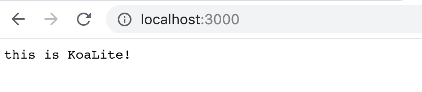
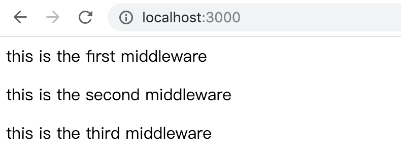

# KoaLite

## 介绍
本文能帮你干什么？
1. [Koa](https://koajs.com) 是一个新的 web 框架，由 Express 幕后的原班人马打造， 致力于成为 web 应用和 API 开发领域中的一个更小、更富有表现力、更健壮的基石。学习一门新的技术，读我们来说很重要。
2. Koa 源码极简，只有短短不到两千行,对于想要了解框架底层原理的同学来说,这很方便。
3. 本文中绝大多数代码都是参考Koa2源码,去除了枝干,保留了主干的部分,如果有说得不对的地方，烦请指正。`
下面就一起来看看具体的内容吧!


### 总览
Koa实际上对nodejs的 http 模块做了简单的封装，下面我将从以下几点来说明：
#### step1. 先来声明一个Koa类，列出核心方法。
```js
module.exports = class Koa {
  constructor() {
    // 这里用于初始化一些实例变量 如 middware
  }
  /**
   *  Koa最终重要的方法之一，注册一个中间件
   */
  use(fn) {}
  /**
   *  在实例化Koa对象后，调用listen方法，监听端口，开启WEB服务
   *  该方法内部会调用nodejs http模块的createServer方法创建
   *  一个 web server,并传入args参数
   */
  listen(...args) {}
};
```
#### step2. 实现listen方法，开启服务
```js
let http = require('http');
module.exports = class Koa {
  constructor() {
    // 这里用于初始化一些实例变量 如 middware
  }
  /**
   *  Koa最终重要的方法之一，注册一个中间件
   */
  use(fn) {}
  /**
   *  在实例化Koa对象后，调用listen方法，监听端口，开启WEB服务
   *  该方法内部会调用nodejs http模块的createServer方法创建
   *  一个 web server,并传入args参数
   */
  listen(...args) {
      let server = http.createServer((req,res)=>this.callback(req,res));
      server.listen(...args);
  }
  /**
   *  在这里处理每一次的请求
   */
  callback(req,res){
      // 这里要做的下面的几件事情
      // 1. compose middleware: 将中间件函数组合成一个函数 fn
      // 2. 将req和res封装为context对象
      // 3. 处理请求并返回结果
      res.end('this is KoaLite!');
  }
};
```
现在编写一段代码来测试一下上面的webserver 是否工作
```js
let koa = require('./Koa')
let app = new koa()
app.listen(3000);
```
运行上面的代码，在浏览器中输入 <pre>localhost:3000</pre>
可以看到下面的结果：

#### step3. 中间件（middleware）实现
1. 在constructor中添加 middlewares 实例属性，用于保存所有注册的middlewares
```js
 constructor() {
    // 这里用于初始化一些实例变量 如 middware
    this.middlewares = [];
  }
```
2. 实现use方法
```js
  /**
   *  Koa最终重要的方法之一，注册一个中间件
   */
  use(fn) {
    // 参数fn应该为‘function’,为了不影响阅读，这里参数fn验证跳过
    this.middlewares.push(fn);
    return this;
  }
```
3. 实现compose功能
从上面1，2两点可以看出,我们使用 use 方法将所有注册的方法保存在一个 middlewares数组中，
接下来需要实现一个compose function,将所有的middleware函数组成一个函数。新建一个compose.js,
内容如下：
```js
module.exports = function(middlewares) {
  // middlewares 是用 app.use(fn) 注册的所有中间件，是一个数组
  return function(context, next) {
    let len = middlewares.len;
    let index = 0;
    if (len === 0) return Promise.resolve(); // 没注册任何中间件的情况
    return dispatch(index);
    /**
     * 从第 0 个中间件函数开始执行，并且将下一个中间件函数注入到当前执行的中间件函数中去，
     * 由当前的中间件函数决定是否继续往后执行接下来的函数
     * eg.
     *
     * app.use(async (ctx,next)=>{
     *    await next(); // 这里的next是下一个中间件函数，调用它则往后执行接下来的middleware
     * })
     *
     * @param i 中间件函数下标
     */
    function dispatch(i) {
      let fn = middlewares[i];
      index += 1;
      if (!fn) return Promise.resolve();
      return Promise.resolve(fn(context, dispatch.bind(null, index)));
    }
  };
};
```
4. 在处理请求时,调用middleware函数，从而实现middleware功能
```js
/**
   *  在这里处理每一次的请求
   */
  callback(req, res) {
    // 这里要做的下面的几件事情
    // 1. compose middleware: 将中间件函数组合成一个函数 fn
    let middlwareFN = compose(this.middlewares);
    // 2. 将req和res封装为context对象,这里只做简单封装，更详细的后续将提及
    let context = { req, res };
    // 3. 处理请求,在处理请求（request）完后，再处理响应(response)
    this.handleRequest(context, middlwareFN);
  }
  /**
   *
   * @param  ctx 上下文对象
   * @param  middlwareFN  组合后的中间件函数
   */
  handleRequest(ctx, middlwareFN) {
    middlwareFN(ctx)
      .then(() => this.handleResponse(ctx))
      .catch(this.handleError); 
  }

  handleResponse(ctx) {
    let body = ctx.res.body;
    let res = ctx.res;
    // 处理不同类型的 context body
    if (Buffer.isBuffer(body)) return res.end(body);
    if ("string" == typeof body) return res.end(body);
    if (body instanceof Stream) return body.pipe(res);
    // body: json
    body = JSON.stringify(body);
    ctx.res.end(body);
  }
  handleError() {
    //处理错误略过
  }
```
5 . 测试一下middleware功能
```js
let koa = require('./Koa')
let app = new koa()
app.use(async (ctx,next)=>{
    ctx.res.body= "<p>this is the first middleware</p>"
    await next();
})
app.use(async (ctx,next)=>{
    ctx.res.body+= "<p>this is the second middleware</p>"
    await next();
})
app.use(async (ctx,next)=>{
    ctx.res.body+= "<p>this is the third middleware</p>"
    await next();
})
app.listen(3000);
```
浏览器运行结果如下：

中间件的功能就实现啦！

#### setp4. 将 request 和 response 对象封装到 context 对象
这一块的内容其实很简单,只需要将req和res中的一些属性或方法交给context对象代理
具体包含以下的一些信息
```js
/**
 * Response delegation.
 */

delegate(proto, 'response')
  .method('attachment')
  .method('redirect')
  .method('remove')
  .method('vary')
  .method('set')
  .method('append')
  .method('flushHeaders')
  .access('status')
  .access('message')
  .access('body')
  .access('length')
  .access('type')
  .access('lastModified')
  .access('etag')
  .getter('headerSent')
  .getter('writable');

/**
 * Request delegation.
 */

delegate(proto, 'request')
  .method('acceptsLanguages')
  .method('acceptsEncodings')
  .method('acceptsCharsets')
  .method('accepts')
  .method('get')
  .method('is')
  .access('querystring')
  .access('idempotent')
  .access('socket')
  .access('search')
  .access('method')
  .access('query')
  .access('path')
  .access('url')
  .access('accept')
  .getter('origin')
  .getter('href')
  .getter('subdomains')
  .getter('protocol')
  .getter('host')
  .getter('hostname')
  .getter('URL')
  .getter('header')
  .getter('headers')
  .getter('secure')
  .getter('stale')
  .getter('fresh')
  .getter('ips')
  .getter('ip');

```
并且还增加了一些工具方法，如  inspect , toJSON 等。
详细代码可以参见源码：
[context.js](https://github.com/koajs/koa/blob/master/lib/context.js) 


本文所有的源码可以再我的github [flyOstrich](https://github.com/flyOstrich/dev_blog/tree/master/%E4%B8%80%E6%AD%A5%E4%B8%80%E6%AD%A5%E5%AE%9E%E7%8E%B0Koa2%E6%A1%86%E6%9E%B6)上找到，
希望对大家深入理解Koa有更多的帮助！


